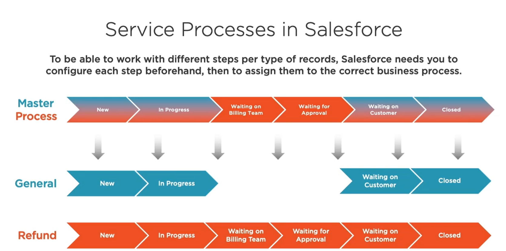
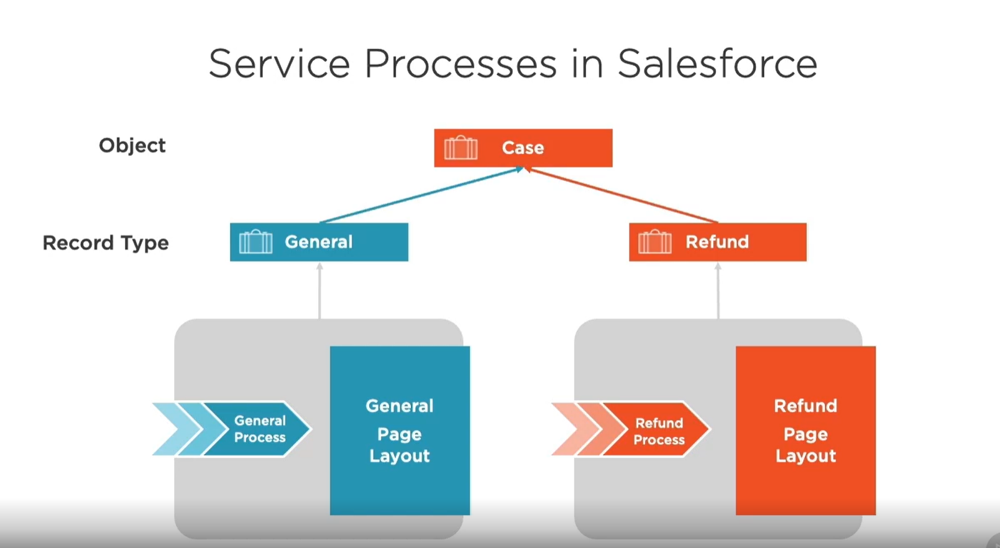

[Understanding and Configuring Service Processes](#Understanding-and-Configuring-Service-Processes)

## Configuring paths to cases 
## Configuring the service console

## Understanding and Configuring Service Processes

### Configuring a business process 

1. Define the Master Process
2. Create the Business Process
3. Create the Page Layouts
4. Create the Record Types
