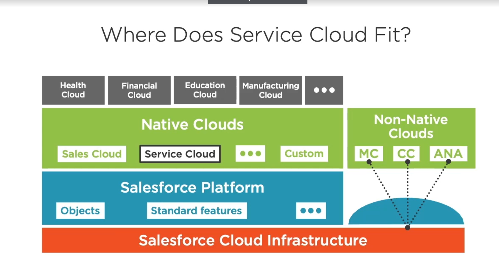
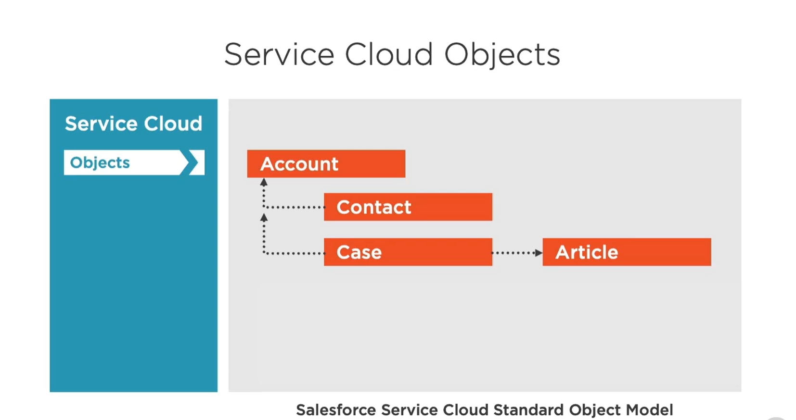
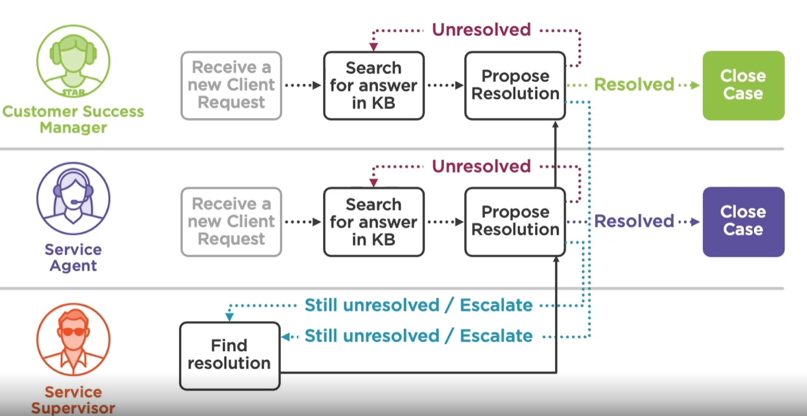

## Example company - Globomantics 

- International company leader in AI 
- Sells artificially intelligent robots to consumers and businesses alike
- Invested in Salesforce Service CLoud to consolidate all their customer data and their service processes 

# Service CLoud Objects?

## Account --> An account is how you record information about the companies you work with. Those could be your clients, potential clients, providers, but also your subsidaries and your competitors.

## Contact --> A contact is how your record information about the physical persons that you interact with in your accounts.

## Case --> A case is where you record information about the support and troubleshooting requests from your customers, partners etc. Those are generally known as Support tickets , and can be used internally at your company.

## Article --> An article capture information about your company's products and services that you want to make available in your knowledge base. They also give guidance to your agents to help them resolve specific types of Cases.

## Service Cloud Desgin

