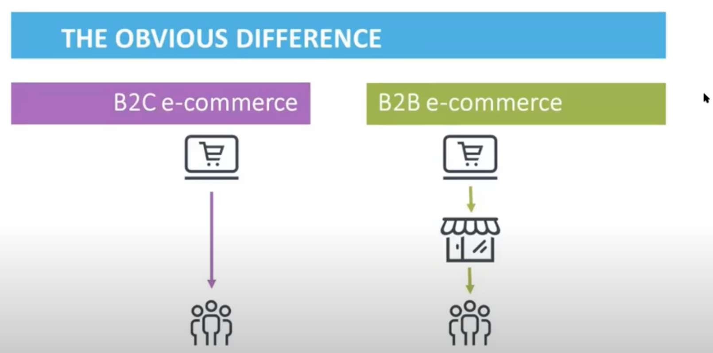

## B2C 
- Selling to the end customer

## B2B
- Selling to another business 



## Commerce Cloud Architecture 


```
Multi-tenancy is an architecture in which a single instance of a software application serves multiple customers. Each customer is called a tenant.
```


## What Are Salesforce Governor Limits?

- Simply put, Salesforce Governor Limits are usage caps enforced by Salesforce to ensure efficient processing. They allow for multiple users of the platform without impeding performance.


